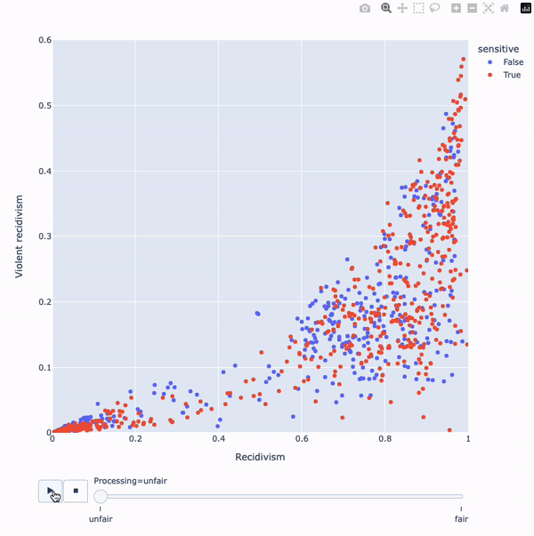

# Implementation for _Fairness in Multi-Task Learning via Wasserstein Barycenters

- Francois Hu ([curiousml.github.io](https://curiousml.github.io/))
- Arthur Charpentier ([freakonometrics.github.io](https://freakonometrics.github.io/))
- Philipp Ratz ([phi-ra.github.io](https://phi-ra.github.io/))


## Main Results

We had to construct our own benchmarks as we are unfortunately unaware of other contributions in the field of Fair-MTL that open-sourced their code. 

Below is an illustration of the core of what our transformations achieve (here on the compas dataset). The sensitive group (which has a disadvantage as shown in previous research), gets lower scores once the transformation is applied. Conversely, the non-senstive group (which was shown to have an undue advantage) gets slightly higher scores. Also clearly visible is the preservation of rank within both subgroups.



## Overview of implementation

The files are organised into the following structure. The main simulations are carried out in `simulation_compas.py` and `simulation_folk.py`. There are also illustrative examples collected in the notebooks tab

```
FMTL
│   README.md
│   requirements.txt
|   simulation_folk.py
|   simulation_compas.py    
│
└───main
│   │
│   └───calibration
│   |   │   custommetrics.py
│   |   │   fairness.py
│   |      
│   └───models
│       │   datasamplers.py
│       │   modelarch.py
│   
└───notebooks
    │   compas_illustration.ipynb
    │   folktabs_illustration.ipynb
    |   transformation_illustration.gif
```

## Datasets

We consider data from the [Folktables package](https://github.com/socialfoundations/folktables) and from the [Compas study](https://github.com/propublica/compas-analysis). 

We base our simulations for the compas data on the file `compas-scores-two-years.csv` from the original studym which should be places in `./data/raw/compas/`.

The folktables simulations are based on the same filter criteria from the benchmarks, but we keep the _Income_ variable continuous rather than binary. The data can be reconstructed by using the following python code snippet.

```
import pandas as pd
import numpy as np
from folktables import ACSDataSource, ACSIncome, ACSMobility

data_source = ACSDataSource(survey_year='2018',
                            horizon='1-Year',
                            survey='person')
                            
ca_data = data_source.get_data(states=["CA"],
									 download=True)
									 
data_source = ACSDataSource(survey_year='2018',
                            horizon='1-Year',
                            survey='person')

ca_data = data_source.get_data(states=["CA"], download=False)

# Use features from both tasks
features_inc, _, _ = ACSIncome.df_to_pandas(ca_data)
features_mob, _, _ = ACSMobility.df_to_pandas(ca_data)

all_variables = set(list(features_inc.columns) + # features from regression probs
                list(features_mob.columns)  + # features from classification
                ['MIG', 'PINCP'])
all_variables.remove('ESP')
all_variables.remove('OCCP')
all_variables.remove('GCL')
want_data = ca_data.loc[:, list(all_variables)].dropna()

# Filters according to doc
want_data = want_data.loc[want_data.AGEP <= 35,: ]
want_data = want_data.loc[want_data.AGEP >= 18,: ]
want_data = want_data.loc[want_data.WKHP >= 1,: ]
want_data = want_data.loc[want_data.PINCP >= 100,: ]
want_data['PINCP'] = np.log(want_data.PINCP)

# Need to transform some manually
want_data['POBP'] = np.where(want_data.POBP > 56, 1, 0) # POB not in US
want_data['MIG'] = np.where(want_data.MIG ==1, 0, 1)

# Set up to scale
target_cols = ['PINCP', 'MIG']
numeric_cols = ['SCHL', 'WKHP', 'JWMNP']
other_cols = want_data.drop(columns = target_cols + numeric_cols).columns

# split
feature_df = want_data.drop(columns=target_cols)
label_df = want_data.loc[:,target_cols]

# store
feature_df.to_csv('data/prepared/folktabs/all_features.csv', 
                   index=False)
label_df.to_csv('data/prepared/folktabs/all_labels.csv', 
                 index=False)

```

